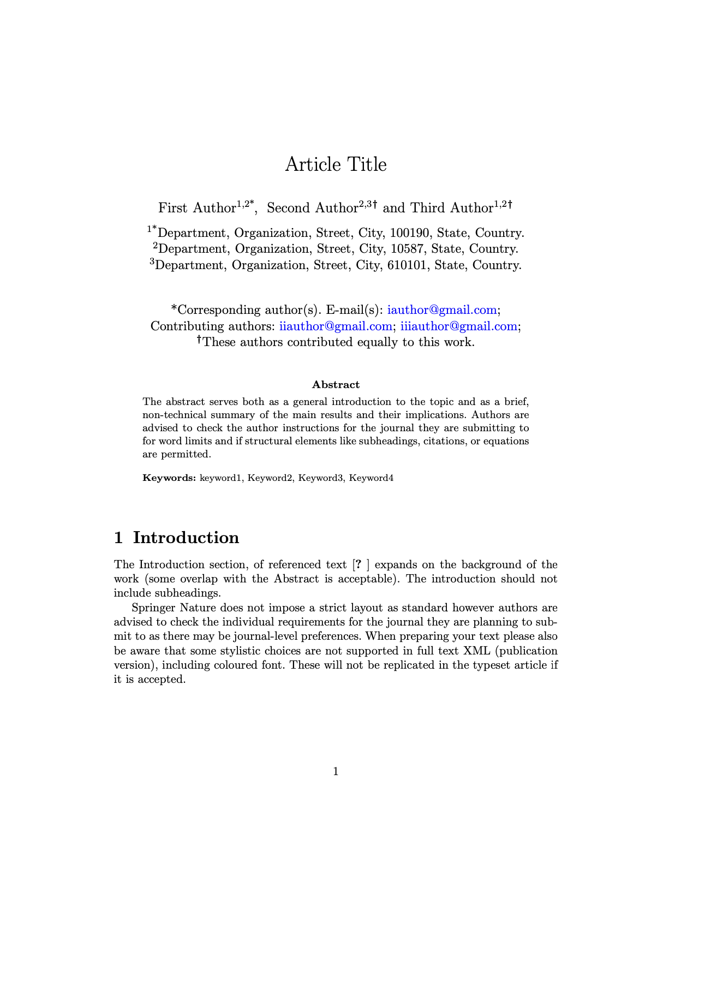

# Springer

Official template for Springer journals

- Author: Springer Nature (Springer Nature Group)
- Author Website: https://www.springernature.com/
- [Submission Guidelines](https://www.springernature.com/gp/authors/campaigns/latex-author-support)

## Steps to creating your own template!

- [x] 🆕 Create this repository. Nailed it. 🚀
- [x] 📑 Replace the `template.tex` with your existing LaTeX template/article
- [x] 👯‍♀️ Copy in any other style, definitions or images necessary for the template
- [x] 👩‍🔬 Add the files necessary into `files` list in the `template.yml` ([documentation](https://myst-tools.org/docs/mystjs/jtex/template-yml))
- [x] 🧙‍♀️ Start replacing template values with `[-options.my_value-]` and put in `[# if parts.abstract #]` conditions to toggle sections on and off ([documentation](https://myst-tools.org/docs/mystjs/jtex/template-rules))
- [x] 👩🏿‍💻 Install [jtex](https://myst-tools.org/docs/mystjs/jtex) (`npm install -g jtex`) and run `jtex check` ([documentation](https://myst-tools.org/docs/mystjs/jtex/command-line))
- [ ] 🪄 Continue to improve the options in your template for `parts` and `options` ([documentation](https://myst-tools.org/docs/mystjs/jtex/document))
- [ ] 💾 When ready, save your `template.yml` and run `jtex check --fix`, this will add various packages that are auto detected and fix document options ([documentation](https://myst-tools.org/docs/mystjs/jtex/command-line))
- [ ] 🧪 Test with real content: `myst build my-document.md --template ../path/to/template` ([documentation](https://myst-tools.org/docs/mystjs/guide/creating-pdf-documents))
- [x] 📸 Create a `thumbnail.png` with an accurate screenshot of the template
- [ ] 🧭 Update this README, and check all values in the `template.yml`
- [ ] 🚀 Push to GitHub, and contribute to the [community templates repository](https://github.com/myst-templates/templates)
