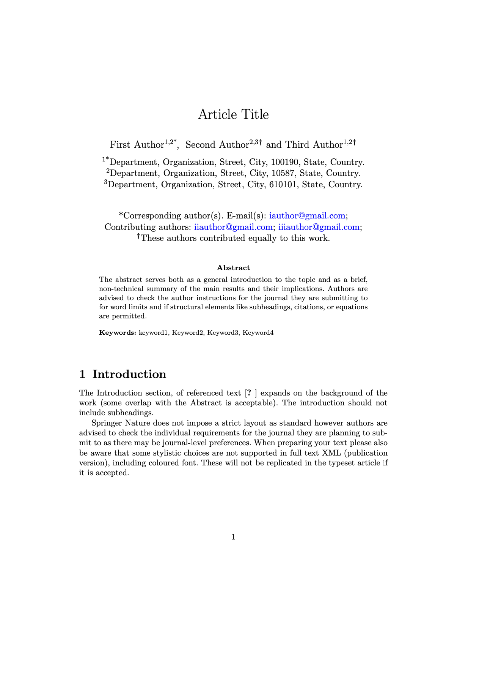

# Springer

A [MyST](https://mystmd.org/) and [jtex](https://mystmd.org/guide/creating-pdf-documents) template for preparing journal articles with the Springer Nature LaTeX class.



This repository is based on version 2.1 (April 2023) of the Springer Nature LaTeX authoring template. Always check the instructions for your target journal before submission; journal-specific requirements take precedence over this template.

- Upstream author guidance: [Springer Nature LaTeX author support](https://www.springernature.com/gp/authors/campaigns/latex-author-support)
- Bundled upstream documentation: [Springer Nature template user manual](./original/user-manual.pdf)

## Requirements

To validate and build the template locally, install:

- [Node.js](https://nodejs.org/)
- MyST and jtex: `npm install -g mystmd jtex`
- A LaTeX distribution that provides `latexmk` and the packages listed in [`template.yml`](./template.yml). A full [TeX Live](https://tug.org/texlive/) or [MacTeX](https://tug.org/mactex/) installation is the simplest option.

Confirm that the required commands are available:

```shell
myst --version
jtex --version
latexmk --version
```

`jtex` is needed when developing or validating the template. Authors building manuscripts need MyST and LaTeX.

## Quick start

Clone the repository and build the complete example article:

```shell
git clone https://github.com/myst-templates/springer.git
cd springer/examples/sn-article
myst build sn-article.md --pdf
```

The generated PDF is written to `_build/exports/sn-article.pdf`. The corresponding generated LaTeX project is under `_build/exports/sn-article_pdf_tex/`.

To use the template in another local MyST project, point the export's `template` field at the repository directory:

```yaml
export:
  - format: pdf+tex
    template: ../path/to/springer
```

Then run `myst build your-article.md --pdf` from that project. See [`examples/sn-article`](./examples/sn-article/) for a complete manuscript. [`examples/simple-example`](./examples/simple-example/) is a shorter demonstration, but its referenced `sn-bibliography.bib` must be supplied before building it.

## Minimal manuscript

Create a Markdown file such as `article.md` and a BibTeX file such as `references.bib` in the same directory:

```markdown
---
title: My Article Title
short_title: Short Title
authors:
  - name: Ada Lovelace
    affiliations: [university]
    corresponding: true
    email: ada@example.org
affiliations:
  - id: university
    institution: Example University
    department: Department of Mathematics
    city: London
    country: United Kingdom
keywords:
  - example
  - MyST
bibliography:
  - references.bib
export:
  - format: pdf+tex
    template: ../path/to/springer
    reference_style: mathphys
    numbered_referencing: true
    formatting: onecolumn
---

+++ {"part": "abstract"}
This is the article abstract.
+++

# Introduction

Write the manuscript in MyST Markdown. Cite a bibliography entry with
{cite:p}`reference-key`.
```

The abstract is required. Author affiliation identifiers must match an entry in `affiliations`. Set `corresponding: true` on each corresponding author and provide an email address when required by the journal.

## Template options

Set template options on the `pdf+tex` export in the document frontmatter.

| Option | Type | Default | Description |
| --- | --- | --- | --- |
| `formatting` | choice | `onecolumn` | Article layout. Choose `onecolumn` or `twocolumn`. |
| `referee` | boolean | `false` | Enables the double-spaced referee layout. |
| `line_numbers` | boolean | `false` | Adds line numbers in the margin, including support around common display-math environments. |
| `unnumbered_headings` | boolean | `false` | Disables section numbering. |
| `numbered_referencing` | boolean | `false` | Requests numbered citations for reference styles that support both author-year and numbered modes. |
| `pdf_latex` | boolean | `true` | Passes the Springer class's `pdflatex` option for pdfLaTeX/XeLaTeX-oriented builds. |
| `reference_style` | choice | `default` | Bibliography style. Choose `default`, `nature`, `basic`, `mathphys`, `vancouver`, `apa`, or `chicago`. |
| `theorem_style` | choice | `none` | Enables theorem environments with style `one`, `two`, or `three`; use `none` to disable them. |
| `theorem_sectionwise_numbering` | boolean | `false` | Numbers theorems within sections when theorem environments are enabled. |
| `proposition_by_theorem_numbering` | boolean | `false` | Uses the theorem counter for propositions when theorem environments are enabled. |

### Reference styles

| Value | Springer class style | Usual citation mode |
| --- | --- | --- |
| `default` | LaTeX default | Numbered |
| `nature` | Nature Portfolio | Numbered |
| `basic` | Basic Springer Nature/Chemistry | Author-year; supports `numbered_referencing` |
| `mathphys` | Mathematics and Physical Sciences | Author-year; supports `numbered_referencing` |
| `vancouver` | Vancouver | Author-year; supports `numbered_referencing` |
| `apa` | APA-based social sciences/psychology | Author-year |
| `chicago` | Chicago-based humanities | Author-year; supports `numbered_referencing` |

Consult the bundled [Springer Nature user manual](./original/user-manual.pdf) and your journal's author instructions before selecting a style.

## Optional manuscript parts

In addition to the required `abstract`, the template recognizes these named parts:

| Part | Rendered as | Required |
| --- | --- | --- |
| `abstract` | Article abstract | Yes |
| `acknowledgments` | Acknowledgments section | No |
| `appendix` | Appendix environment | No |
| `declarations` | Unnumbered Declarations section | No |
| `supplementary_information` | Supplementary information section | No |

Add a part with a fenced block:

```markdown
+++ {"part": "acknowledgments"}
We thank the project contributors.
+++
```

Check the target journal's requirements for declarations, ethics statements, data and code availability, author contributions, and supplementary files.

## Repository layout

- `template.yml` — jtex metadata, supported document fields, parts, options, and bundled files
- `template.tex` — active jtex/LaTeX template
- `sn-jnl.cls` and `sn-*.bst` — bundled Springer Nature class and bibliography styles
- `examples/simple-example` — compact MyST manuscript example (requires its referenced bibliography file)
- `examples/sn-article` — fuller conversion of the upstream sample article
- `original` — upstream release files and user manual used as the source material

## Template development

Validate changes to the template definition with:

```shell
jtex check
```

Then build at least one example PDF to test the generated LaTeX and bibliography pipeline:

```shell
cd examples/sn-article
myst build sn-article.md --pdf
```

Build products are placed in `_build/` and are ignored by Git.

## Troubleshooting

- If PDF rendering reports `latexmk: command not found`, install a LaTeX distribution and ensure its binary directory is on `PATH`.
- If LaTeX reports a missing package, install that package through your TeX distribution or use a full TeX Live/MacTeX installation.
- If a bibliography cannot be found, verify that every path under `bibliography` is relative to the manuscript and that the `.bib` file exists.
- If template options are rejected, compare them with the choices in [`template.yml`](./template.yml); jtex validates choice values before export.

## License and provenance

The template metadata declares the [LaTeX Project Public License 1.3a](https://www.latex-project.org/lppl/). The `original` directory preserves the Springer Nature source material used to create this MyST adaptation.
